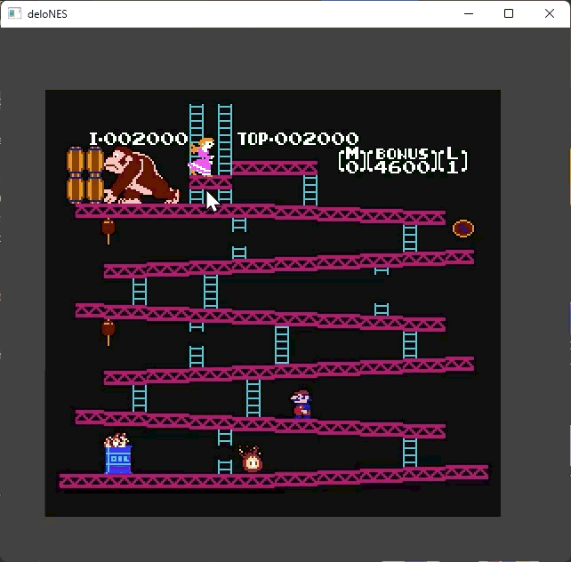
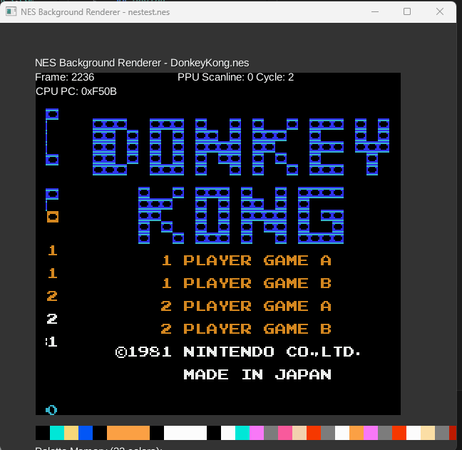
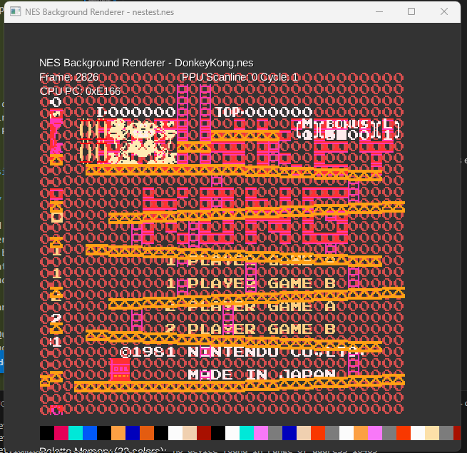

# deloNES
a Java and LibGDX NES Emulator POC

## Reference links

- [NESdev Wiki](https://www.nesdev.org/wiki/Nesdev_Wiki) — canonical NES hardware reference
- [OneLoneCoder olcNES](https://github.com/OneLoneCoder/olcNES) — C++ reference implementation that inspired this project ([per-component review](docs/olcnes_review.md))
- [bugzmanov NES ebook](https://bugzmanov.github.io/nes_ebook/) — Rust-based step-by-step build with strong PPU/scrolling chapters ([review](docs/bugzmanov_nes_ebook_review.md))


## Devlog
### 5-12-2026
* **Donkey Kong first level playable!** Title screen renders correctly; Mario, Pauline, barrels, oil drum + fire all in place; sprite/BG alignment correct.
* 
* Fixed PPU BG fetcher pipeline:
  * +2 tile lookahead during visible cycles (so the fetcher loads col 2 at cycle 1 while col 0 — pre-fetched on the previous scanline — renders at cycle 1).
  * Cycles 321-337 prefetch correctly reads col 0 and col 1 of the *next* scanline; BG shifters now shift during prefetch too, so col 0 ends in the HIGH byte by start of next scanline. Previously the leftmost ~16 pixels of every scanline rendered stale shifter data.
* Honored PPUMASK bit 1 (BG leftmost-8 clip): leftmost 8 pixels render backdrop when bit is clear.
* Added `DKDiagnosticRunner` (`./gradlew desktop:traceDK`) — pure-Java headless harness that dumps PPU registers, OAM, nametable summary, palette RAM, and ASCII framebuffer snapshots. The tool that finally pinned down the fetcher pipeline bug after multiple rounds of inconclusive visual-screenshot guessing. Kept in-tree as the canonical agent-friendly debugging entry point.
### 5-11-2026
* **ROM startup menu shipped.** Keyboard-navigable `RomSelectScreen` listing bundled ROMs (via `RomCatalog` reading `roms/index.txt`) plus a "Browse filesystem..." option via LWJGL3 `TinyFileDialogs`. Selection transitions to `EmulatorScreen`; Esc returns to menu, F5 resets, P pauses. `NesGame extends Game` glues the screens together.
* Configurable input via `controls.json` (auto-written with defaults on first run): P1 = Arrows + Z/X/Enter/RShift, P2 = WASD + G/H/LShift/Tab. Two-player keyboard input fully wired.
* Replaced the open-bus stub `Controller` with a real shift-register implementation (P1 @ $4016, P2 @ $4017). Fixed `CPUBus.read()` to route $4016/$4017 to the controller *before* the APU (real-hardware order).
* PPU NMI now decoupled via a `nmiPending` latch — `NesSystem.tick()` polls `consumeNmi()` once per master tick and dispatches to `cpu.nmi()`. DK's wait-for-NMI loop now exits.
* OAM DMA actually runs: `EmulatorScreen` and `NestestBackgroundRenderer` migrated to `NesSystem.runFrame()` so `CPUBus.clock()` drives the DMA state machine on $4014 writes. DMA also respects `OAMADDR` per NESdev.
* PPU $2004 (OAMDATA) write/read no longer stubbed — they hit `oam[OAMADDR]` with auto-increment on write.
* Sprite-0 hit: replaced coarse-bounding-box check with per-pixel opacity test (both sprite-0 *and* BG pixel must be opaque), plus leftmost-8 PPUMASK gate and the `x != 255` rule.
* `EmulatorScreen` extracted from `NestestBackgroundRenderer` as a reusable LibGDX `Screen` taking a `RomSource` (classpath or filesystem).
* `DonkeyKong.nes` is *not* committed (fair-use copy only — no redistribution rights). `nestest.nes` is the bundled default. Drop your own DK locally + add to `roms/index.txt` to surface it in the menu, or use the filesystem-browse entry.
### 1-1-2026
* fixed background tile rendering (issue with PPU using ARGB vs RGBA causing alpha being read from wrong spot)
* 
### 12-31-2025
* Background rendering working with bugs! 
* 
### 12-28-2025

* Fixed tests
* add CHR ROM viewer

### 12-25-2025

* Merry Christmas!
* added support for all undocumented/illegal opcodes
* full nestest headless validation 8992/8992 output match

### 12-24-2025

* finally got back to working on this (had a new job + baby)
* added rendering of arbitrary pixel array
* added cpu opcode unit tests
* added nestest validation (identified cpu bugs)

### 6-2-2024

* ppu work
* load color palettes

### 5-29-2024

* cartridge setup work

### 5-16-2024

* added basic mapper interface, started work n loading the cartridge

### 5-15-2024

* finally added to github
* completed instructions (untested)
* created basic way to load test programs
* First successful program output!
* takes 10 multiplies by 3 and puts 30 in memory

```
16:13:12.104 [main] INFO  net.lomibao.nes.NesEmulator - memory 0x0000
16:13:12.104 [main] INFO  net.lomibao.nes.NesEmulator - 0A 03 1E 00 00 00 00 00 00 00 00 00 00 00 00 00 // (10) (3) (30) 

16:13:12.105 [main] INFO  net.lomibao.nes.NesEmulator - memory 0x8000
16:13:12.105 [main] INFO  net.lomibao.nes.NesEmulator - A2 0A 8E 00 00 A2 03 8E 01 00 AC 00 00 A9 00 18 //the program code 
6D 01 00 88 D0 FA 8D 02 00 EA EA EA 00 00 00 00 
```

### 5-14-2024

* added code for around half the instructions

### 5-13-2024

* finished code for cpu addressing modes

### 5-12-2024

* setup Ram and basic cpuBus read/write interaction

### 5-10-2024

* loaded instructions into cpu from csv

### 5-09-2024

* setup base project
* got libgdx running
* got text to display on screen
* setup basic cpuBus class
* setup basic cpu class
* converted instruction timings and data into csv
* setup registers

